# dp3t-ux-screenflows-ch

## Introduction
This repository holds the links to InVision prototypes that show the current development of the SwissCovid App as seen in the following repositories:
* Android App: [dp3t-app-android-ch](https://github.com/DP-3T/dp3t-app-android-ch)
* iOS App: [dp3t-app-ios-ch](https://github.com/DP-3T/dp3t-app-ios-ch)

The screen flows give on overview of the user flows of the SwissCovid App. This enables people that are not able to build the apps from the source code to see and test the user interface of the SwissCovid App.

## Screen Flows
The links below lead to an InVision click prototype that guide through the SwissCovid App.
### German
#### App in normal mode
https://invis.io/JG112THMT89Q#/452571153_Home_-_1_Healthy_DE

#### Onboarding
User flow on first app start. Clarifications and permissions.
https://invis.io/TA113NQMJ73V#/452909860_Onboarding-1

#### Check-in
User flow "notification after possible infection"
https://invis.io/JG112THMT89Q#/452571147_Check-In_1

#### Check-ins anbieten
User flow "notification after possible infection"
https://invis.io/JG112THMT89Q#/452571171_Check-Ins-QR-Code-Empty

#### Meldungen
User flow "notification after possible infection"
https://invis.io/JG112THMT89Q#/452571177_Reports_Exposed_intro

#### Covidcode
User flow "notification after possible infection"
https://invis.io/JG112THMT89Q#/452571188_covid_Code_1

#### Info
User flow "notification after possible infection"
https://invis.io/JG112THMT89Q#/452571185_Info-Home

#### Zahlen
User flow "notification after possible infection"
https://invis.io/JG112THMT89Q#/452754518_Zahlen

### English
#### App in normal mode
https://invis.io/TA113NQMJ73V#/452909872_Home_-_1_Healthy_DE

#### Onboarding
User flow on first app start. Clarifications and permissions.
https://invis.io/TA113NQMJ73V#/452909860_Onboarding-1

#### Check-in
User flow "notification after possible infection"
https://invis.io/TA113NQMJ73V#/452909879_Check-In_1

#### Offer check-ins
User flow "notification after possible infection"
https://invis.io/TA113NQMJ73V#/452909888_Check-Ins-QR-Code-Empty

#### Reports
User flow "notification after possible infection"
https://invis.io/TA113NQMJ73V#/452909894_Reports_Exposed_intro

#### Covidcode
User flow "notification after possible infection"
https://invis.io/TA113NQMJ73V#/452909905_covid_Code_1

#### Info
User flow "notification after possible infection"
https://invis.io/TA113NQMJ73V#/452909902_Info-Home

#### Stats
User flow "notification after possible infection"
https://invis.io/TA113NQMJ73V#/452909921_Zahlen

## Screenshots
### English

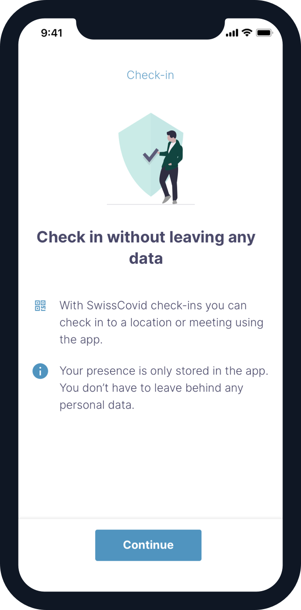
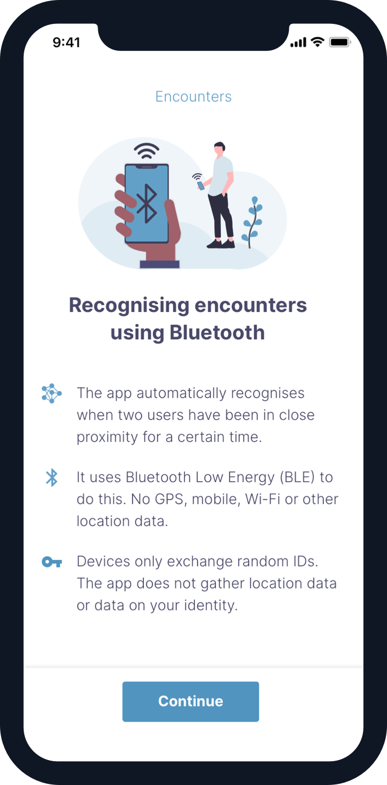

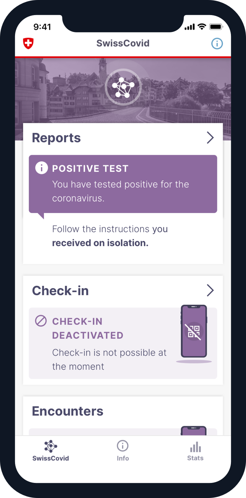

### German

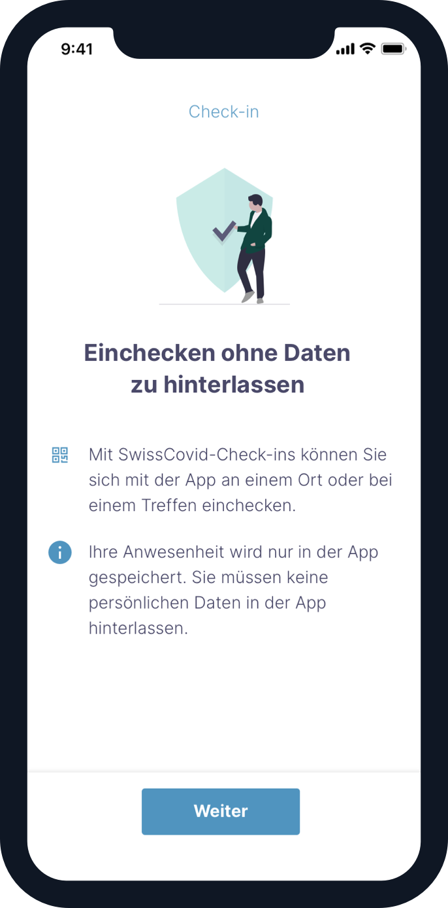
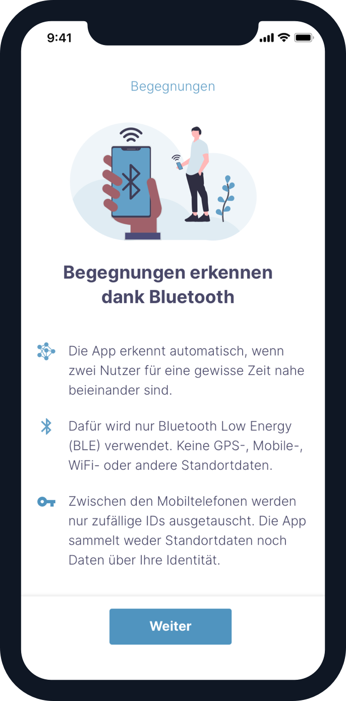

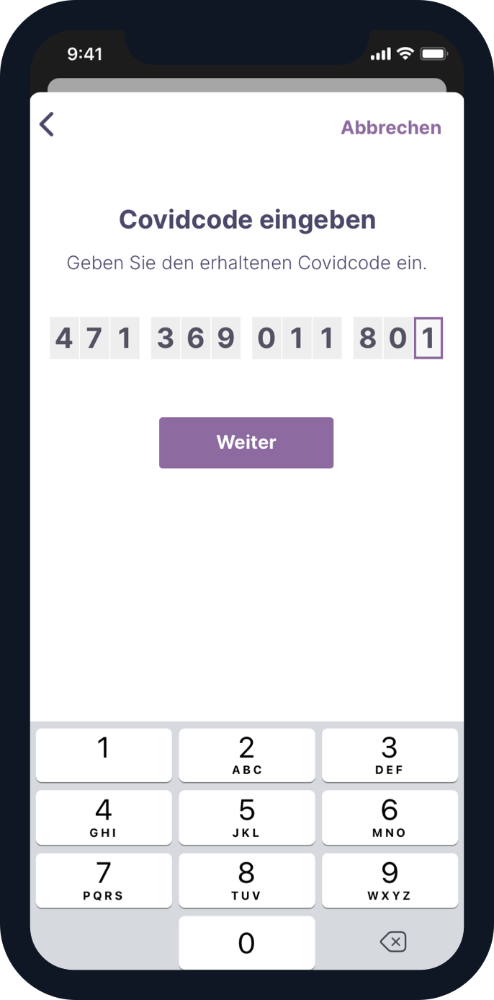
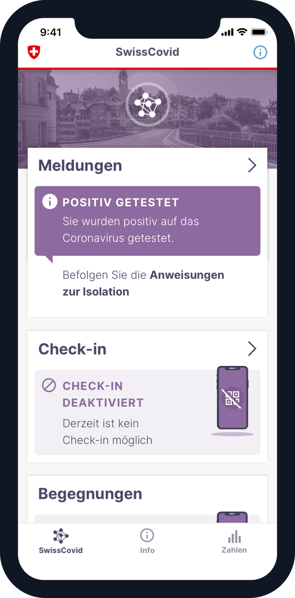

### French

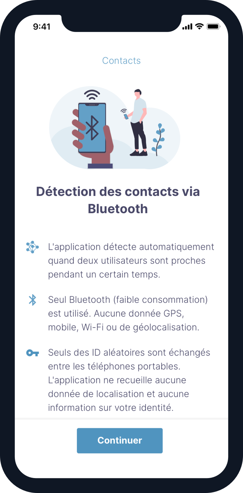

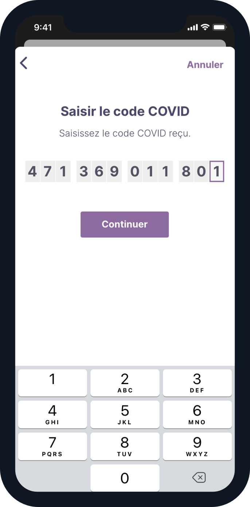
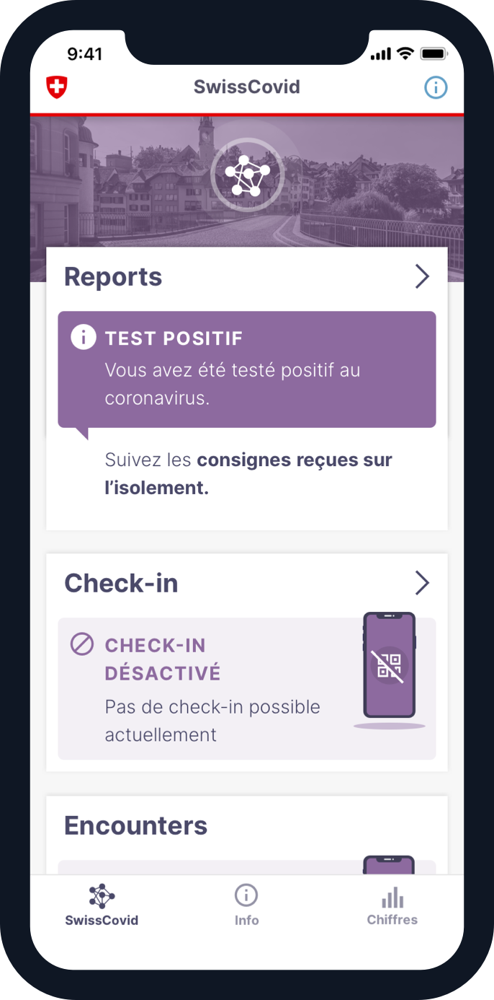

### Italian

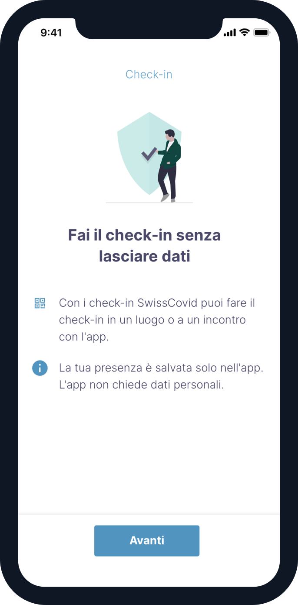
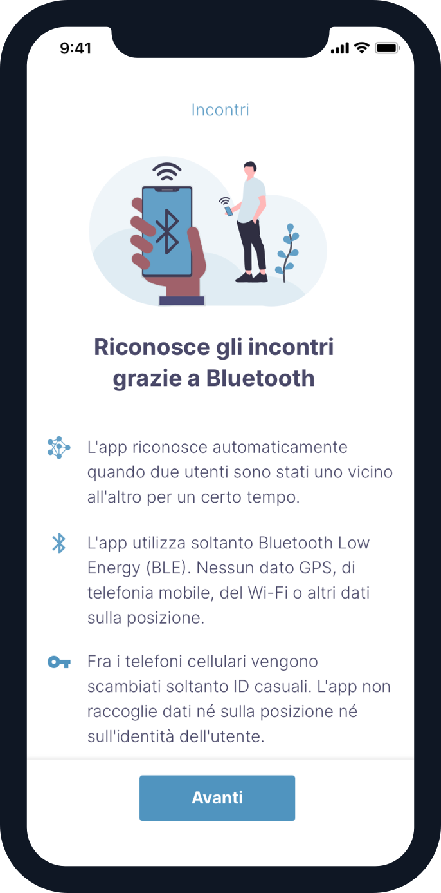

