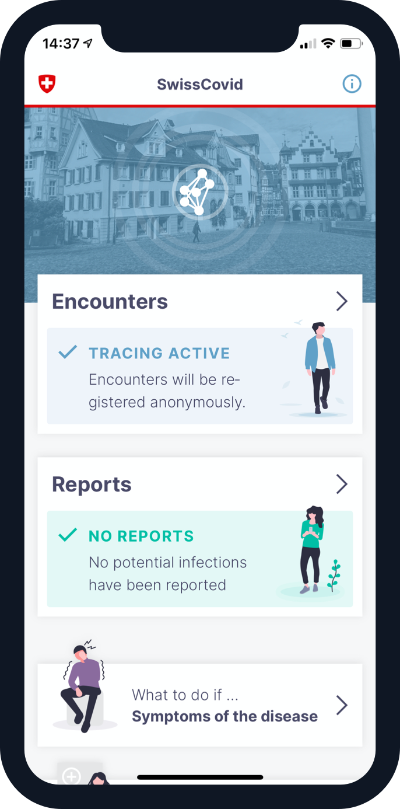
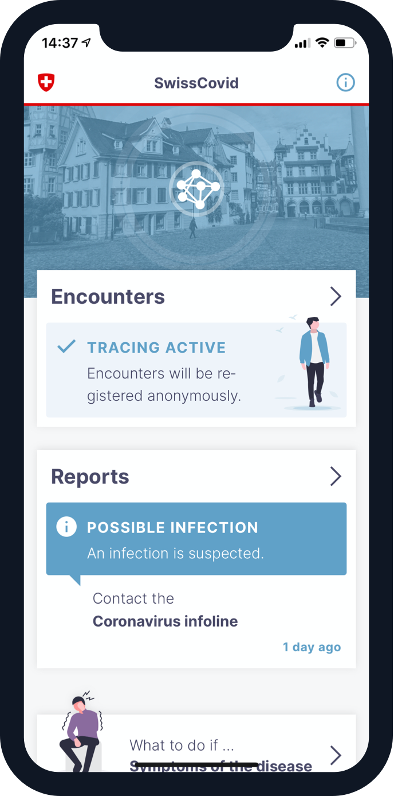
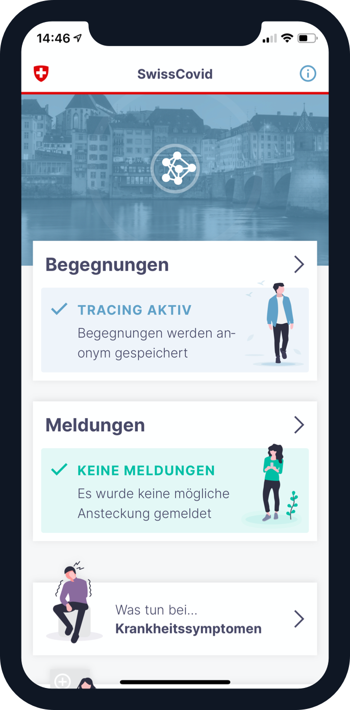
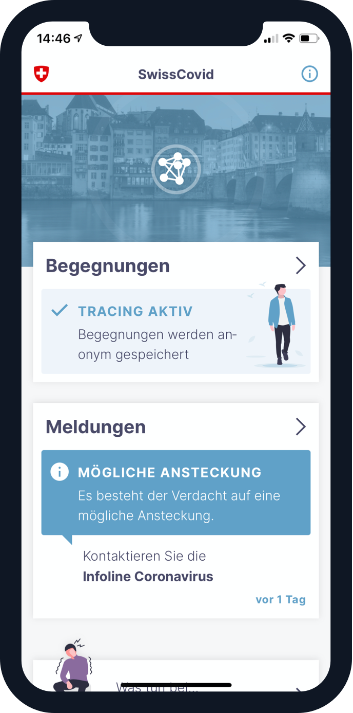
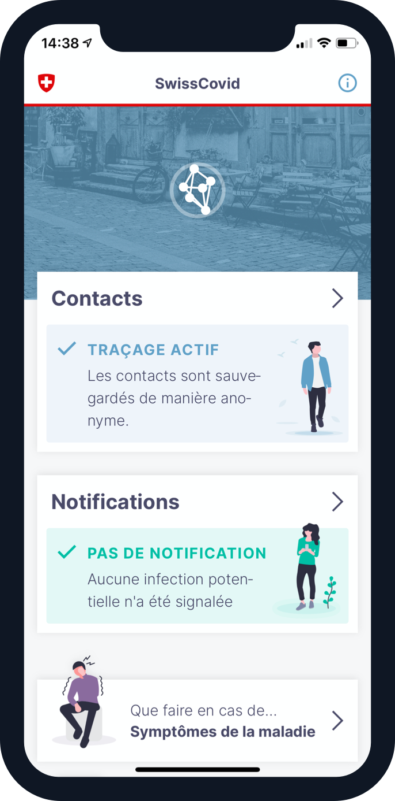
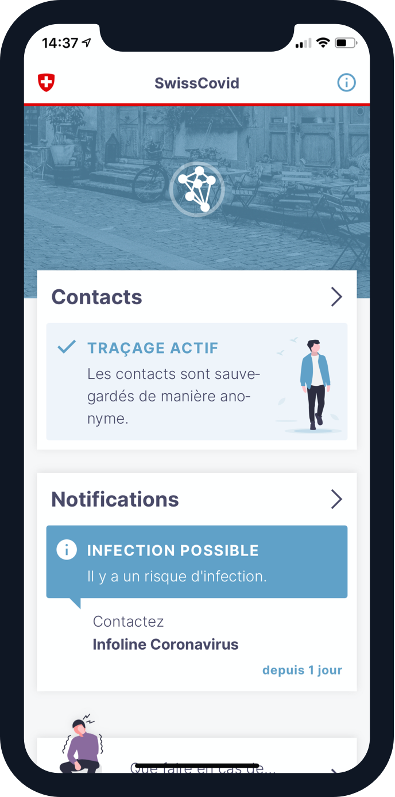
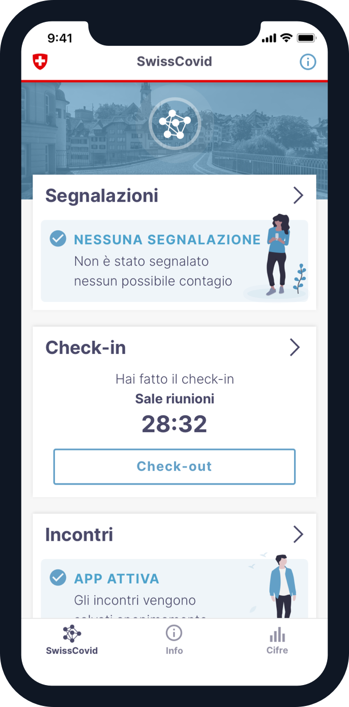
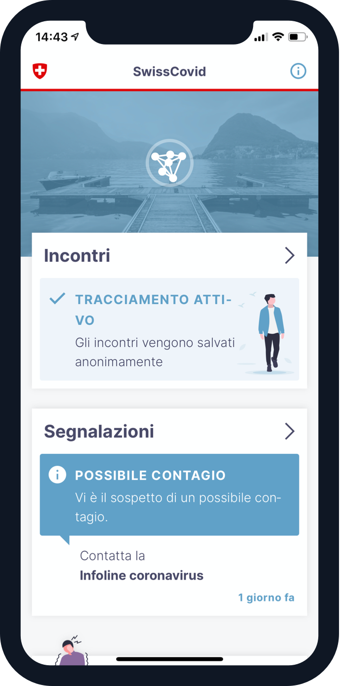

# dp3t-ux-screenflows-ch

## Introduction
This repository holds the links to InVision prototypes that show the current development of the SwissCovid App as seen in the following repositories:
* Android App: [dp3t-app-android-ch](https://github.com/DP-3T/dp3t-app-android-ch)
* iOS App: [dp3t-app-ios-ch](https://github.com/DP-3T/dp3t-app-ios-ch)

The screen flows give on overview of the user flows of the SwissCovid App. This enables people that are not able to build the apps from the source code to see and test the user interface of the SwissCovid App.

## DRAFT: International Interoperability
The following prototype illustrates a possible integration of the international interoperability feature into SwissCovid from a UX-perspective:
https://invis.io/T8Y6BK5ZU45

## Screen Flows
The links below lead to an InVision click prototype that guide through the SwissCovid App.
### German
#### App in normal mode
https://invis.io/TXXC5V1YPB8

#### Onboarding iOS
User flow on first app start. Clarifications and permissions.
https://invis.io/TXXC5V1YPB8#/418111146_Start_Onboarding

#### Onboarding Android
User flow on first app start. Clarifications and permissions.
https://invis.io/TXXC5V1YPB8#/418111265_Start_Onboarding_Android

#### Notification
User flow "notification after possible infection"
https://invis.io/TXXC5V1YPB8#/418111257_Notification_Lock

### French
NOTE: the screenflows in french do not reflect the latest state of the texts in the app.

#### App in normal mode
https://invis.io/UYXCRD728XE

#### Onboarding iOS
User flow on first app start. Clarifications and permissions. 
https://invis.io/UYXCRD728XE#/418290507_Start_Onboarding

#### Onboarding Android
User flow on first app start. Clarifications and permissions.
https://invis.io/UYXCRD728XE#/418290566_Start_Onboarding_Android

#### Notification
User flow "notification after possible infection" 
https://invis.io/UYXCRD728XE#/418290605_Notification_Lock

## Contribution Guide
Results of UX-Tests based on the prototypes as well as potential problems on UX and accessibility matters are welcome and should be reported using Github Issues.

## Static Screens
Static screenshots of the app can be found [here](screenshots)

### English

### German

### French

### Italian

