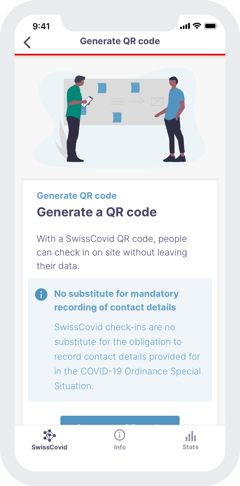
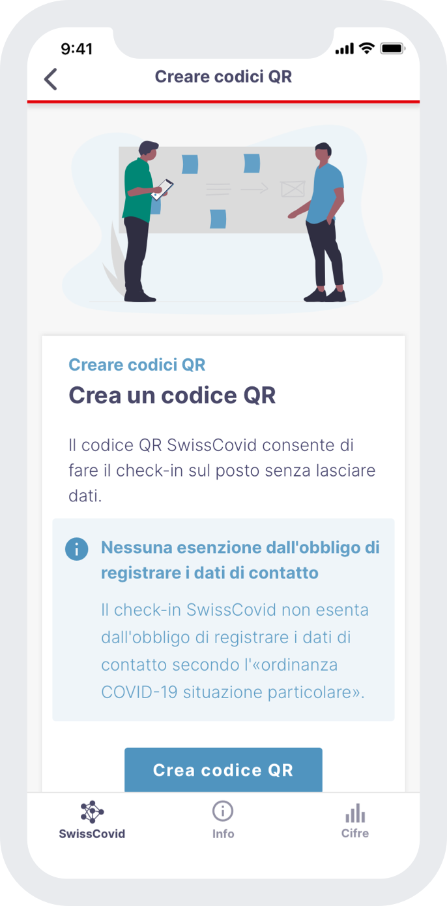

<h1 align="center">SwissCovid UX Screenflows</h1>

## Introduction
This repository holds the links to InVision prototypes that show the current development of the SwissCovid App as seen in the following repositories:
* Android App: [swisscovid-app-android](https://github.com/SwissCovid/swisscovid-app-android)
* iOS App: [swisscovid-app-ios](https://github.com/SwissCovid/swisscovid-app-ios)
* Further documentation: [swisscoivd-doc](https://github.com/SwissCovid/swisscovid-doc)

The screen flows give an overview of the user flows of the SwissCovid App. This enables people that are not able to build the apps from the source code to see and test the user interface of the SwissCovid App.

## Screen Flows
The links below lead to an InVision click prototype that guide through the SwissCovid App.
### German
https://invis.io/6R1158ZEFK47

### English
https://invis.io/WV1158ZUAXNZ

## Contribution Guide
Results of UX-Tests based on the prototypes as well as potential problems on UX and accessibility matters are welcome and should be reported using Github Issues.

## Screenshots

### English

### German

### French

### Italian

